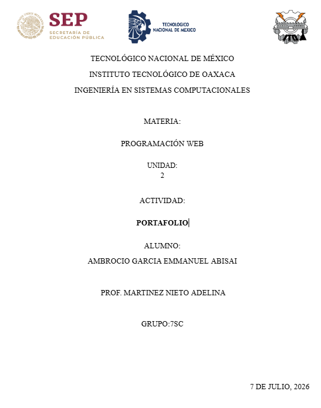
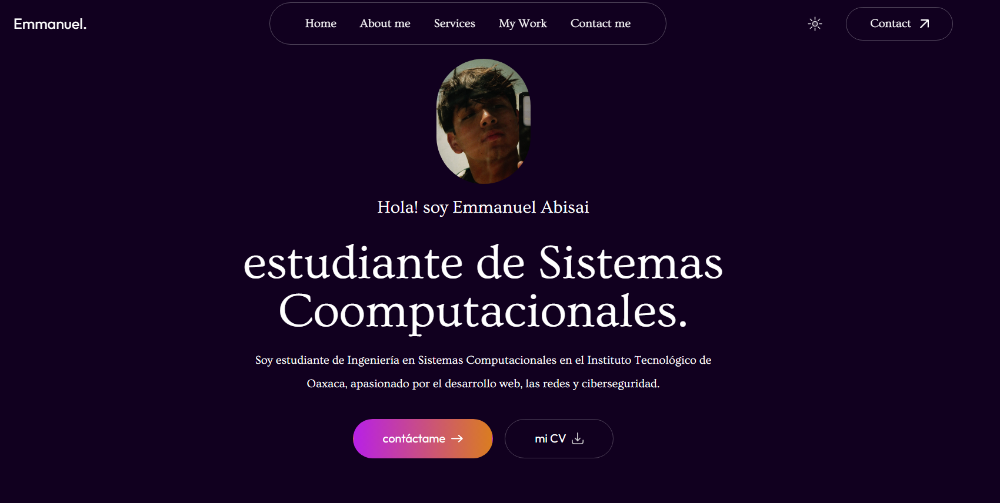
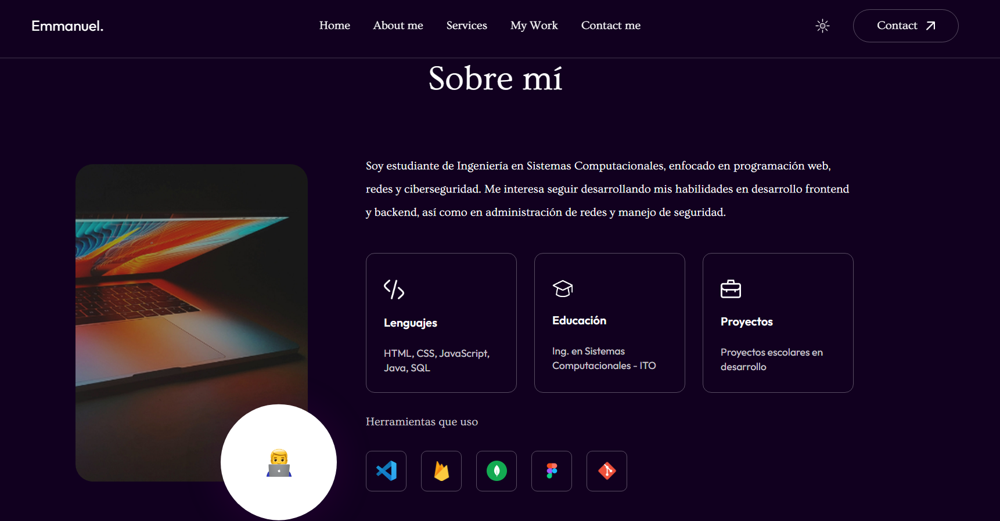
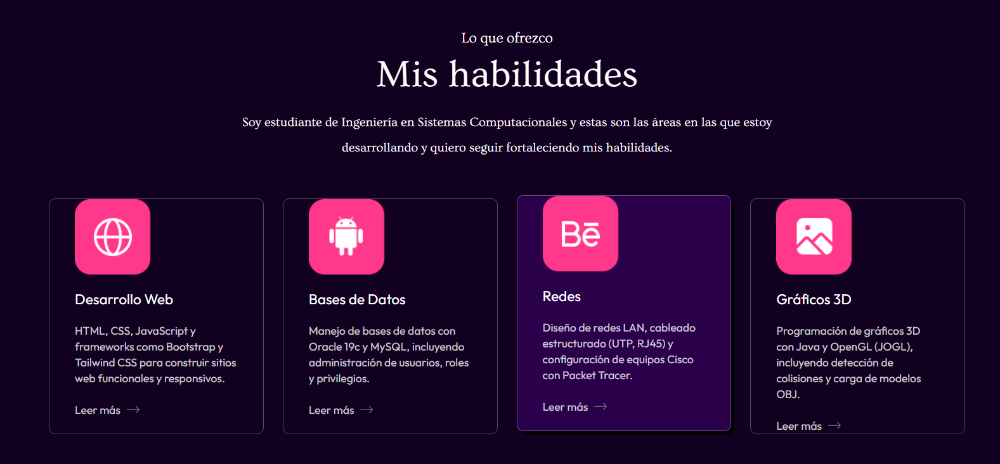
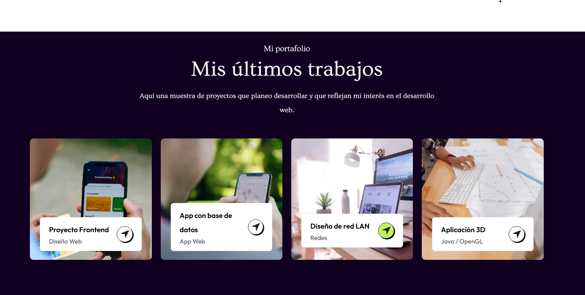
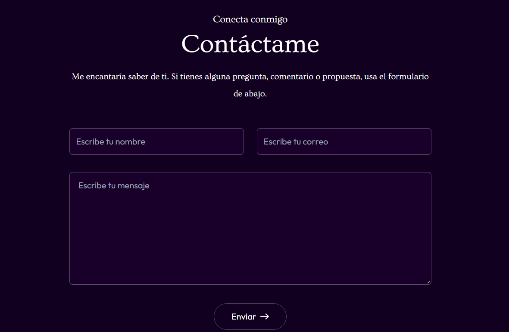
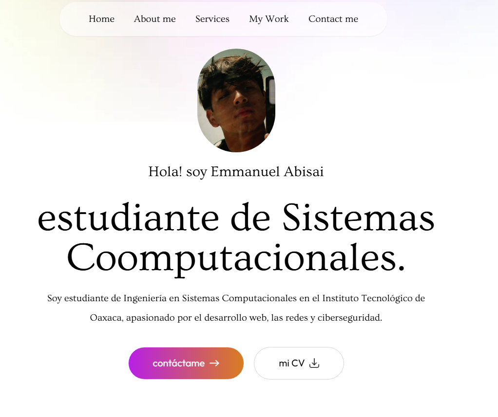

# Mi Portafolio - Emmanuel Abisai

¡Hola! Este es mi portafolio personal, hecho como estudiante de Ingeniería en Sistemas Computacionales del Instituto Tecnológico de Oaxaca. Aquí muestro un poco de quién soy, mis habilidades y algunos proyectos (reales y otros que quiero hacer próximamente).

---

## Descripción del proyecto

Este portafolio está construido con **HTML, CSS y JavaScript**, usando **Tailwind CSS** como framework de estilos (vía CDN).

La plantilla base que usé fue **Eliana Portfolio Template**, la pueden descargar aquí:
 [https://prebuiltui.com/react-templates/eliana-portfolio-template](https://prebuiltui.com/react-templates/eliana-portfolio-template)

### Secciones del portafolio

El portafolio tiene un menú de navegación con las siguientes secciones:

- **Inicio (Home)**: Lo primero que se ve al entrar, con mi foto de perfil, mi nombre y una breve frase de presentación, además de botones para contactarme o descargar mi CV.
- **Sobre mí (About me)**: Aquí cuento un poco más sobre quién soy, qué estudio y en qué áreas me estoy enfocando (programación web, redes y ciberseguridad). También muestro mis herramientas de trabajo (VS Code, Firebase, MongoDB, Figma, Git).
- **Servicios / Habilidades (Services)**: Muestro las áreas en las que estoy desarrollando mis habilidades: Desarrollo Web, Bases de Datos, Redes y Gráficos 3D.
- **Mi trabajo (My Work)**: Una muestra de proyectos que planeo o estoy desarrollando, como un proyecto frontend, una app con base de datos, un diseño de red LAN y una aplicación 3D.
- **Contáctame (Contact)**: Un formulario para que cualquiera me pueda escribir, además de mi correo directo al final de la página.

---

## Proceso de creación

1. Descargué la plantilla **Eliana Portfolio Template** desde PrebuiltUI.
2. Como la plantilla original venía pensada para React, adapté todo el maquetado a **HTML + Tailwind CSS puro**, sin usar ningún framework de JavaScript.
3. Organicé el proyecto en carpetas: `css/`, `js/` e `img/`, tal como se nota en el Repositorio.
4. Cambié el logo por mi nombre en texto ("Emmanuel.") en vez de usar una imagen de logo.
5. Cambié el texto de presentación ("Hi! I'm...") por uno personalizado en español.
6. Actualicé la foto de perfil por una mía, real y profesional (no genérica ni de stock).
7. Modifiqué el texto de la sección "Sobre mí" para incluir mis áreas de interés: programación web, redes y ciberseguridad.
8. Rellené la sección de proyectos con ideas de proyectos que quiero desarrollar próximamente, ya que aún no tengo proyectos reales terminados.
9. Actualicé el correo de contacto y los datos del footer con mi información real.
10. Revisé que todo se viera bien tanto en modo claro como en modo oscuro (dark mode), ya que la plantilla lo incluye.

---

## Capturas de pantalla

---

## Ver en vivo

 GitHub Pages: [*(pega aquí el link cuando lo actives)*](https://emmaabisa.github.io/Portafolio/)
 Repositorio: [https://github.com/EmmaAbisa/Portafolio](https://github.com/EmmaAbisa/Portafolio)

---
